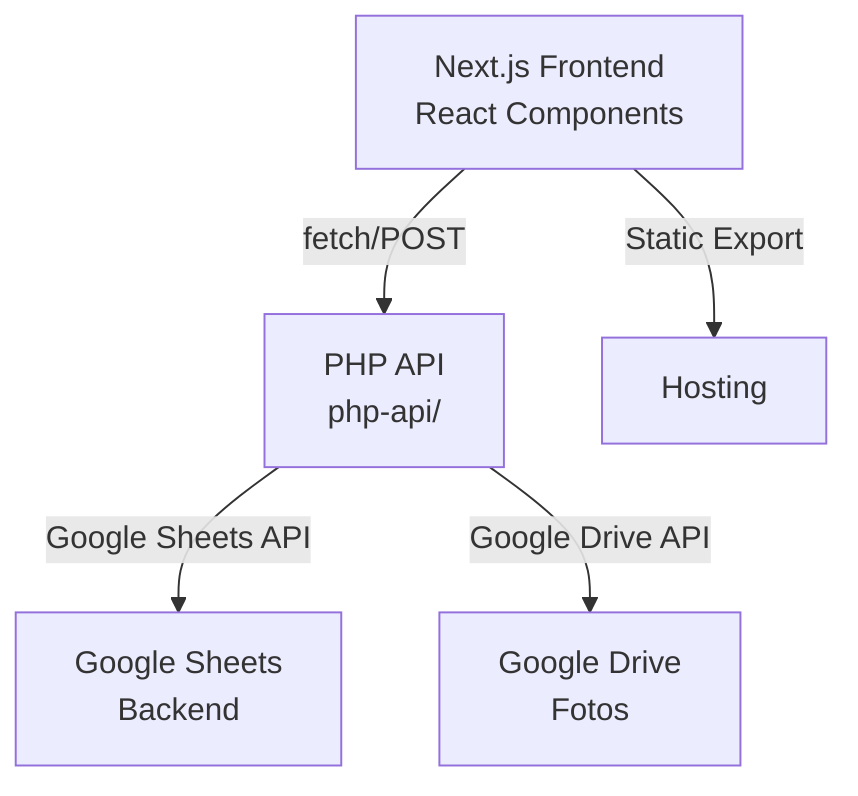
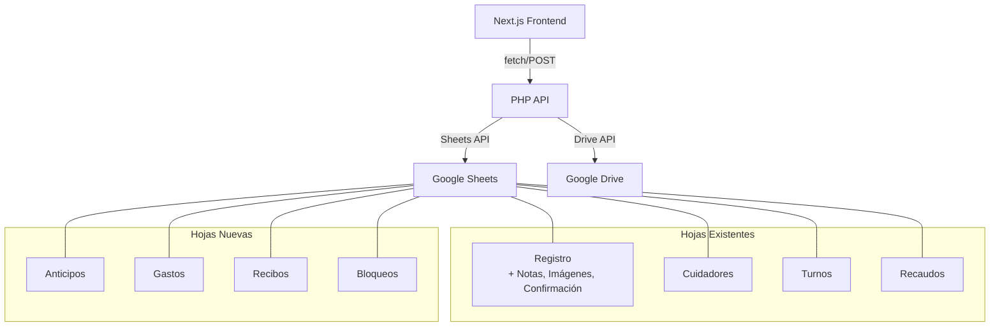
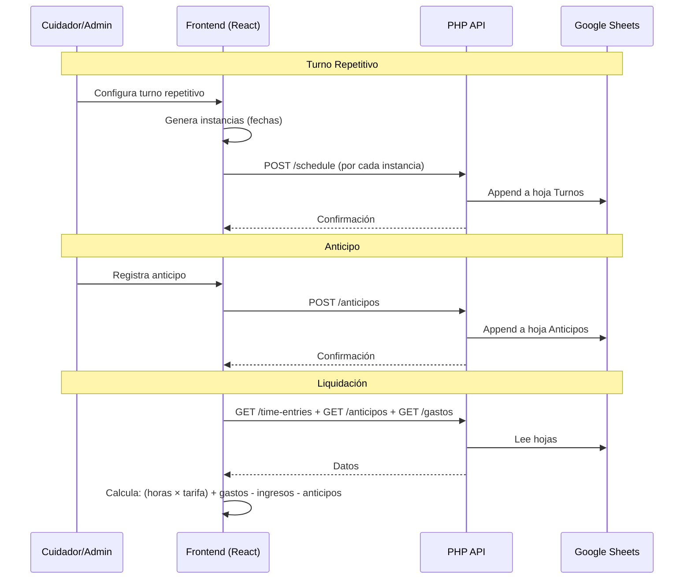
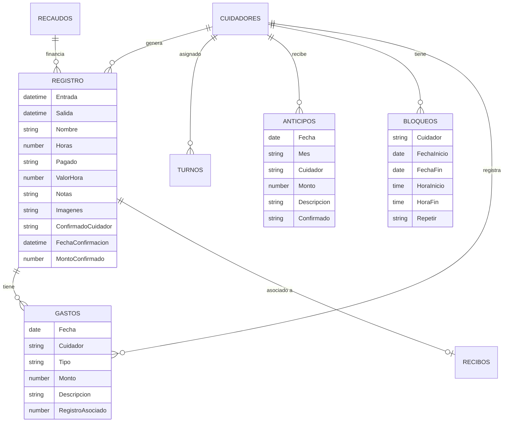

# Documento de Diseño — Rediseño de Programación, Pagos y UX

## Visión General

Este documento describe el diseño técnico para la mejora integral de la aplicación **Marujita Horas**, abarcando tres áreas principales:

1. **Programación de Turnos**: Selección mejorada de día, turnos de día completo, registro multi-día, alertas de turno próximo, turnos repetitivos y bloqueo de horarios.
2. **Mejoras de UI/UX**: Rediseño de botones, mejoras en registro por lote, simplificación de historial, notas e imágenes en historial, y semana iniciando en lunes.
3. **Funcionalidades de Pagos**: Marcado masivo, recibos de pago, anticipos, gestión de alertas con edición, gastos extra en turnos activos, y confirmación de pagos por cuidadores.

### Decisiones de Diseño Clave

- **Sin datos mockeados**: Toda la información proviene del Google Sheets backend vía php-api. Las nuevas funcionalidades requieren nuevas hojas/columnas en el spreadsheet.
- **Nuevas hojas de Google Sheets**: Se necesitan hojas adicionales para Anticipos, Gastos, Recibos y Bloqueos.
- **Nuevas columnas**: La hoja "Registro" necesita columnas adicionales para notas, imágenes y confirmación de pago del cuidador.
- **Arquitectura existente preservada**: Se mantiene el patrón Next.js (frontend) + PHP API + Google Sheets. No se introduce nueva infraestructura.
- **UI en español**: Toda la interfaz permanece en español.

## Arquitectura

### Arquitectura Actual



### Arquitectura Propuesta

La arquitectura se mantiene igual, pero se amplía con:



### Flujo de Datos para Nuevas Funcionalidades



## Componentes e Interfaces

### Componentes Nuevos

| Componente | Descripción | Requisitos |
|---|---|---|
| `ShiftDayPicker` | Selector de día con paso intermedio para tipo de turno | Req 1 |
| `MultiDayRegistration` | Formulario de registro multi-día con rango de fechas | Req 2 |
| `UpcomingShiftAlert` | Banner de alerta para turnos próximos con botón de confirmación | Req 3 |
| `RepeatShiftConfig` | Configuración de frecuencia y período para turnos repetitivos | Req 4 |
| `BlockScheduleDialog` | Diálogo para crear/gestionar bloqueos de horario | Req 5 |
| `BulkPaymentBar` | Barra flotante para marcado masivo de pagos | Req 11 |
| `PaymentReceiptDialog` | Diálogo para adjuntar recibos de pago con imagen | Req 12 |
| `AdvancePaymentDialog` | Formulario para registrar anticipos | Req 13 |
| `AlertDetailPanel` | Panel de detalle de alerta con opciones de edición | Req 14 |
| `ActiveShiftExpenses` | Panel de gastos extra y dinero recibido durante turno activo | Req 15 |
| `PaymentConfirmation` | Botón/diálogo de confirmación de pago por cuidador | Req 16 |
| `ImageViewerModal` | Visor modal de imágenes con navegación | Req 9 |
| `CollapsibleFilters` | Filtros colapsables para la vista de historial | Req 8 |

### Componentes Modificados

| Componente | Cambios | Requisitos |
|---|---|---|
| `ScheduleView` | Semana inicia en lunes, nuevo flujo de asignación con `ShiftDayPicker`, soporte para turnos repetitivos y bloqueos, botones de navegación mejorados | Req 1, 4, 5, 10 |
| `BatchHistoricalDialog` | Selector de cuidador como cuadrícula de avatares, preselección de perfil activo, avance de fecha incluye fines de semana | Req 7 |
| `HistoryView` | Filtros colapsables, título destacado, notas e imágenes en tarjetas, modo selección múltiple, confirmación de pago por cuidador | Req 8, 9, 11, 12, 16 |
| `AdminAlertsPanel` | Panel de detalle al hacer clic, opciones de edición y aprobación | Req 14 |
| `Button` (ui) | Estilo píldora con gradientes y sombra para botones de acción | Req 6 |

### Endpoints PHP Nuevos

| Endpoint | Método | Descripción |
|---|---|---|
| `php-api/anticipos.php` | GET/POST | CRUD de anticipos de pago |
| `php-api/gastos.php` | GET/POST | CRUD de gastos extra y dinero recibido |
| `php-api/recibos.php` | GET/POST | CRUD de recibos de pago con imagen |
| `php-api/bloqueos.php` | GET/POST | CRUD de bloqueos de horario |
| `php-api/confirm-payment.php` | POST | Confirmación de pago por cuidador |

### Endpoints PHP Modificados

| Endpoint | Cambios |
|---|---|
| `php-api/schedule.php` | Soporte para turnos repetitivos (acción "add-repeat"), validación contra bloqueos |
| `php-api/toggle-paid.php` | Soporte para marcado masivo (acción "bulk-toggle"), escritura de recibo asociado |
| `php-api/time-entries.php` | Lectura de columnas adicionales (Notas, Imágenes, Confirmación) |

### Interfaces TypeScript Nuevas

```typescript
// Turno repetitivo
interface RepeatConfig {
  frequency: "daily" | "weekly"
  endDate: string // YYYY-MM-DD
}

// Bloqueo de horario
interface ScheduleBlock {
  rowIndex: number
  personName: string
  startDate: string // YYYY-MM-DD
  endDate: string   // YYYY-MM-DD
  startTime?: string // HH:mm (opcional, si es rango horario específico)
  endTime?: string   // HH:mm
  repeat?: "weekly"
  repeatEndDate?: string
  reason?: string
}

// Anticipo
interface Advance {
  rowIndex: number
  personName: string
  amount: number
  date: string // YYYY-MM-DD
  month: string // YYYY-MM
  description: string
  confirmedByCaregiver: boolean
  confirmationDate?: string
}

// Gasto extra / Dinero recibido
interface ShiftExpense {
  rowIndex: number
  personName: string
  entryRowIndex: number // Referencia al registro de tiempo
  type: "expense" | "income"
  amount: number
  description: string
  date: string
}

// Recibo de pago
interface PaymentReceipt {
  rowIndex: number
  personName: string
  month: string // YYYY-MM
  notes: string
  description: string
  imageFileId?: string
  imageUrl?: string
  createdAt: string
}

// Confirmación de pago por cuidador
interface PaymentConfirmation {
  entryRowIndex: number
  confirmedAt: string
  amountReceived?: number
}

// Registro multi-día
interface MultiDayConfig {
  startDate: string
  endDate: string
  startTime: string // Hora inicio del primer día
  endTime: string   // Hora fin del último día
}

// Alerta extendida
interface AdminAlertExtended {
  id: string
  type: "overlap-same" | "overlap-cross" | "inconsistency" | "no-show" | "multi-day"
  message: string
  personName: string
  otherPerson?: string
  date: string
  timestamp: string
  resolved: boolean
  entryRowIndex?: number // Para edición directa
  approvedBy?: string
  approvalDate?: string
}


// Funciones del API client nuevas
interface ApiClientExtensions {
  // Anticipos
  fetchAdvances(month?: string): Promise<Advance[]>
  postAdvance(data: { action: "add" | "edit" | "delete", ...Partial<Advance> }): Promise<any>
  
  // Gastos
  fetchExpenses(entryRowIndex?: number): Promise<ShiftExpense[]>
  postExpense(data: { action: "add" | "delete", ...Partial<ShiftExpense> }): Promise<any>
  
  // Recibos
  fetchReceipts(month?: string): Promise<PaymentReceipt[]>
  postReceipt(data: FormData): Promise<any> // multipart para imagen
  
  // Bloqueos
  fetchBlocks(weekStart?: string): Promise<ScheduleBlock[]>
  postBlock(data: { action: "add" | "remove", ...Partial<ScheduleBlock> }): Promise<any>
  
  // Confirmación de pago
  postPaymentConfirmation(entryRowIndex: number, amountReceived?: number): Promise<any>
  
  // Marcado masivo
  postBulkTogglePaid(rowIndices: number[], paid: boolean): Promise<any>
}
```

### Funciones de Lógica de Negocio

```typescript
// lib/schedule-utils.ts — Nuevas utilidades de programación

/**
 * Genera instancias de turno para un turno repetitivo.
 * Respeta la frecuencia y el rango de fechas.
 */
function generateRepeatInstances(
  startDate: string,
  endDate: string,
  frequency: "daily" | "weekly",
  startTime: string,
  endTime: string
): Array<{ date: string; startTime: string; endTime: string }>

/**
 * Genera registros individuales para un registro multi-día.
 * Primer día: startTime → 23:59
 * Días intermedios: 00:00 → 23:59
 * Último día: 00:00 → endTime
 */
function generateMultiDayRecords(
  config: MultiDayConfig
): Array<{ date: string; startTime: string; endTime: string }>

/**
 * Detecta conflictos entre un turno y bloqueos activos.
 */
function checkBlockConflicts(
  personName: string,
  date: string,
  startTime: string,
  endTime: string,
  blocks: ScheduleBlock[]
): ScheduleBlock | null

/**
 * Calcula el inicio de semana (lunes) para una fecha dada.
 */
function getWeekStartMonday(date: Date): Date

/**
 * Avanza la fecha al siguiente día calendario (sin saltar fines de semana).
 */
function getNextCalendarDay(date: string): string

// lib/settlement-utils.ts — Cálculo de liquidación

/**
 * Calcula la liquidación completa para un cuidador en un mes.
 * Fórmula: (horas × tarifa) + gastos_extra - dinero_recibido - anticipos
 */
function calculateSettlement(
  entries: TimeEntry[],
  advances: Advance[],
  expenses: ShiftExpense[],
  hourlyRate: number
): {
  grossPay: number
  totalExpenses: number
  totalIncome: number
  totalAdvances: number
  netPay: number
}

/**
 * Determina si una alerta de turno próximo debe mostrarse.
 * Retorna true si el turno está a 30 minutos o menos de su inicio.
 */
function shouldShowUpcomingAlert(
  shiftDate: string,
  shiftStartTime: string,
  currentTime: Date
): boolean

/**
 * Determina si se debe generar una alerta de no-show.
 * Retorna true si han pasado más de 60 minutos desde el inicio del turno
 * sin confirmación.
 */
function shouldGenerateNoShowAlert(
  shiftDate: string,
  shiftStartTime: string,
  currentTime: Date,
  confirmed: boolean
): boolean
```

## Modelos de Datos

### Hojas de Google Sheets — Estructura Completa

#### Hoja "Registro" (Existente — Columnas Ampliadas)

| Columna | Campo | Tipo | Descripción |
|---|---|---|---|
| A | Entrada | DateTime (DD/MM/YYYY, HH:mm:ss) | Fecha y hora de entrada |
| B | Salida | DateTime | Fecha y hora de salida |
| C | Nombre | String | Nombre del cuidador |
| D | Horas | Number | Total de horas trabajadas |
| E | Pagado | String ("Sí"/"No") | Estado de pago |
| F | Valor Hora | Number | Valor hora calculado (COP) |
| **G** | **Notas** | **String** | **Notas del turno (nuevo)** |
| **H** | **Imágenes** | **String** | **IDs de archivos de Drive separados por coma (nuevo)** |
| **I** | **Confirmado Cuidador** | **String ("Sí"/"No")** | **Confirmación de pago por cuidador (nuevo)** |
| **J** | **Fecha Confirmación** | **DateTime** | **Fecha/hora de confirmación (nuevo)** |
| **K** | **Monto Confirmado** | **Number** | **Monto que el cuidador confirma haber recibido (nuevo)** |

#### Hoja "Turnos" (Existente — Sin Cambios)

| Columna | Campo | Tipo | Descripción |
|---|---|---|---|
| A | Fecha | Date (YYYY-MM-DD) | Fecha del turno |
| B | Cuidador | String | Nombre del cuidador |
| C | Hora Inicio | Time (HH:mm) | Hora de inicio |
| D | Hora Fin | Time (HH:mm) | Hora de fin |

#### Hoja "Anticipos" (Nueva)

| Columna | Campo | Tipo | Descripción |
|---|---|---|---|
| A | Fecha | Date (YYYY-MM-DD) | Fecha del anticipo |
| B | Mes | String (YYYY-MM) | Mes al que aplica |
| C | Cuidador | String | Nombre del cuidador |
| D | Monto | Number | Monto del anticipo (COP) |
| E | Descripción | String | Descripción opcional |
| F | Fecha Registro | DateTime | Fecha/hora de creación |
| G | Confirmado | String ("Sí"/"No") | Confirmación del cuidador |
| H | Fecha Confirmación | DateTime | Fecha/hora de confirmación |

#### Hoja "Gastos" (Nueva)

| Columna | Campo | Tipo | Descripción |
|---|---|---|---|
| A | Fecha | Date (YYYY-MM-DD) | Fecha del gasto |
| B | Cuidador | String | Nombre del cuidador |
| C | Tipo | String ("gasto"/"ingreso") | Tipo de movimiento |
| D | Monto | Number | Monto (COP) |
| E | Descripción | String | Descripción del gasto/ingreso |
| F | Registro Asociado | Number | rowIndex del registro de tiempo |
| G | Fecha Registro | DateTime | Fecha/hora de creación |

#### Hoja "Recibos" (Nueva)

| Columna | Campo | Tipo | Descripción |
|---|---|---|---|
| A | Mes | String (YYYY-MM) | Mes del recibo |
| B | Cuidador | String | Nombre del cuidador |
| C | Notas | String | Notas del recibo |
| D | Descripción | String | Descripción del pago |
| E | Imagen ID | String | ID del archivo en Google Drive |
| F | Imagen URL | String | URL de visualización |
| G | Fecha Registro | DateTime | Fecha/hora de creación |

#### Hoja "Bloqueos" (Nueva)

| Columna | Campo | Tipo | Descripción |
|---|---|---|---|
| A | Cuidador | String | Nombre del cuidador bloqueado |
| B | Fecha Inicio | Date (YYYY-MM-DD) | Inicio del bloqueo |
| C | Fecha Fin | Date (YYYY-MM-DD) | Fin del bloqueo |
| D | Hora Inicio | Time (HH:mm) | Hora inicio (opcional, vacío = todo el día) |
| E | Hora Fin | Time (HH:mm) | Hora fin (opcional) |
| F | Repetir | String ("semanal"/"") | Frecuencia de repetición |
| G | Repetir Hasta | Date (YYYY-MM-DD) | Fecha fin de repetición |
| H | Motivo | String | Razón del bloqueo |
| I | Fecha Registro | DateTime | Fecha/hora de creación |

### Diagrama de Relaciones entre Hojas



## Propiedades de Correctitud

*Una propiedad es una característica o comportamiento que debe mantenerse verdadero en todas las ejecuciones válidas de un sistema — esencialmente, una declaración formal sobre lo que el sistema debe hacer. Las propiedades sirven como puente entre especificaciones legibles por humanos y garantías de correctitud verificables por máquina.*

### Propiedad 1: Registro multi-día genera registros individuales correctos

*Para cualquier* rango de fechas válido (fecha inicio ≤ fecha fin) con horas de inicio y fin, la función `generateMultiDayRecords` SHALL producir exactamente N registros (donde N = número de días en el rango), donde el primer registro usa la hora de inicio especificada, el último registro usa la hora de fin especificada, y los registros intermedios usan 00:00–23:59.

**Validates: Requirements 2.2**

### Propiedad 2: Registro multi-día genera alerta administrativa

*Para cualquier* registro multi-día confirmado con un nombre de cuidador y rango de fechas válido, el sistema SHALL generar exactamente una alerta administrativa que contenga el nombre del cuidador, las fechas del rango y la cantidad total de horas.

**Validates: Requirements 2.3**

### Propiedad 3: Notificación de turno próximo respeta umbral de 30 minutos

*Para cualquier* turno programado y cualquier tiempo actual, la función `shouldShowUpcomingAlert` SHALL retornar `true` si y solo si la diferencia entre la hora de inicio del turno y el tiempo actual es mayor que 0 y menor o igual a 30 minutos.

**Validates: Requirements 3.1**

### Propiedad 4: Alerta de no-show después de 60 minutos

*Para cualquier* turno programado, tiempo actual y estado de confirmación, la función `shouldGenerateNoShowAlert` SHALL retornar `true` si y solo si han pasado más de 60 minutos desde la hora de inicio del turno y el turno no ha sido confirmado.

**Validates: Requirements 3.5**

### Propiedad 5: Turno repetitivo genera todas las instancias correctas

*Para cualquier* configuración de turno repetitivo válida (fecha inicio, fecha fin, frecuencia diaria o semanal, horas), la función `generateRepeatInstances` SHALL producir exactamente el número correcto de instancias según la frecuencia, donde cada instancia tiene la fecha correcta según el patrón de repetición y las mismas horas de inicio y fin.

**Validates: Requirements 4.2**

### Propiedad 6: Eliminación de instancia individual no afecta otras

*Para cualquier* conjunto de instancias de turno repetitivo, eliminar una instancia específica SHALL dejar todas las demás instancias sin modificar.

**Validates: Requirements 4.3**

### Propiedad 7: Detección de conflictos en turnos repetitivos

*Para cualquier* conjunto de turnos existentes y cualquier configuración de turno repetitivo, el sistema SHALL identificar correctamente todas y solo las fechas donde existe un conflicto de solapamiento de horarios para la misma persona.

**Validates: Requirements 4.4**

### Propiedad 8: Bloqueo impide y desbloqueo permite creación de turnos (round-trip)

*Para cualquier* bloqueo de horario activo y cualquier intento de creación de turno, si el turno se solapa con el bloqueo para el mismo cuidador, la creación SHALL ser rechazada. Además, después de eliminar el bloqueo, la misma creación de turno SHALL ser aceptada.

**Validates: Requirements 5.2, 5.5**

### Propiedad 9: Avance de fecha incluye todos los días de la semana

*Para cualquier* fecha del calendario, la función `getNextCalendarDay` SHALL retornar exactamente el día siguiente del calendario (fecha + 1 día), sin saltar sábados ni domingos.

**Validates: Requirements 7.3, 7.4**

### Propiedad 10: Semana inicia en lunes y navegación es correcta

*Para cualquier* fecha, la función `getWeekStartMonday` SHALL retornar el lunes de esa semana. Además, navegar a la semana anterior SHALL retornar el lunes 7 días antes, y navegar a la semana siguiente SHALL retornar el lunes 7 días después. El rango mostrado SHALL ir del lunes al domingo.

**Validates: Requirements 10.1, 10.3, 10.4**

### Propiedad 11: Notas e imágenes se muestran cuando están presentes

*Para cualquier* registro de tiempo con notas no vacías, la tarjeta renderizada SHALL contener el texto de las notas. *Para cualquier* registro con N imágenes (N > 0), el indicador SHALL mostrar el número N.

**Validates: Requirements 9.1, 9.2**

### Propiedad 12: Selección masiva y acción de marcado

*Para cualquier* conjunto de registros seleccionados, el conteo mostrado en el botón de acción SHALL ser igual al número de registros seleccionados. Después de confirmar el marcado masivo, todos los registros seleccionados SHALL tener estado pagado = true.

**Validates: Requirements 11.3, 11.4**

### Propiedad 13: Cálculo de liquidación con anticipos, gastos e ingresos

*Para cualquier* conjunto de registros de tiempo, anticipos, gastos extra y dinero recibido para un cuidador en un mes, la liquidación neta SHALL ser igual a: (horas × tarifa) + suma(gastos_extra) − suma(dinero_recibido) − suma(anticipos).

**Validates: Requirements 13.3, 15.4**

### Propiedad 14: Historial muestra entradas diferenciadas con indicadores de estado

*Para cualquier* mezcla de registros de tiempo, anticipos y pagos en el historial de un cuidador, cada tipo SHALL mostrarse como una entrada visualmente diferenciada. *Para cualquier* registro marcado como pagado sin confirmación del cuidador, SHALL mostrarse un indicador de "Pendiente de confirmación".

**Validates: Requirements 13.4, 15.5, 16.3, 16.5**

### Propiedad 15: Edición desde alerta resuelve la alerta

*Para cualquier* alerta con un registro de tiempo asociado, después de editar el registro a través del panel de la alerta, la alerta SHALL ser marcada como resuelta automáticamente.

**Validates: Requirements 14.4**

## Manejo de Errores

### Errores de Red y API

| Escenario | Comportamiento |
|---|---|
| Fallo de conexión con Google Sheets | Mostrar toast con mensaje "Error de conexión. Intenta de nuevo." y botón de reintentar |
| Timeout en operación de escritura | Reintentar automáticamente una vez, luego mostrar error al usuario |
| Conflicto de turno repetitivo | Mostrar diálogo con lista de fechas conflictivas y opciones: omitir conflictos o cancelar |
| Bloqueo impide creación de turno | Mostrar mensaje explicativo con el motivo del bloqueo y el período afectado |
| Error al subir imagen de recibo | Guardar el recibo sin imagen y mostrar opción de reintentar la subida |
| Fallo en marcado masivo parcial | Marcar los exitosos, mostrar lista de fallidos con opción de reintentar |

### Validaciones del Frontend

| Validación | Mensaje |
|---|---|
| Registro multi-día con fecha fin < fecha inicio | "La fecha de fin debe ser posterior a la fecha de inicio" |
| Turno repetitivo sin fecha de fin | "Selecciona una fecha de fin para la repetición" |
| Anticipo con monto ≤ 0 | "Ingresa un monto válido mayor a cero" |
| Gasto extra sin descripción | "Agrega una descripción para el gasto" |
| Confirmación de pago sin monto | Permitir confirmación sin monto (campo opcional) |
| Bloqueo con rango horario inválido | "La hora de fin debe ser posterior a la hora de inicio" |

### Validaciones del Backend (PHP)

| Validación | Código HTTP | Mensaje |
|---|---|---|
| Turno en fecha/hora bloqueada | 400 | "{Cuidador} tiene un bloqueo de horario del {fecha_inicio} al {fecha_fin}" |
| Anticipo duplicado (mismo cuidador, misma fecha) | 400 | "Ya existe un anticipo para {cuidador} en esta fecha" |
| Intento de editar registro pagado | 400 | "No se puede editar un registro que ya fue pagado" |
| Falta hoja requerida en spreadsheet | 500 | "La hoja {nombre} no existe. Créala en Google Sheets." |

## Estrategia de Testing

### Testing Dual

La estrategia combina tests unitarios (ejemplos específicos) con tests basados en propiedades (verificación universal).

#### Tests Basados en Propiedades (PBT)

Se utilizará **fast-check** como librería de property-based testing para TypeScript/JavaScript.

**Configuración:**
- Mínimo 100 iteraciones por propiedad
- Cada test referencia su propiedad del documento de diseño
- Formato de tag: `Feature: schedule-payments-ux-overhaul, Property {N}: {texto}`

**Funciones objetivo para PBT:**
- `generateMultiDayRecords()` — Propiedades 1, 2
- `shouldShowUpcomingAlert()` — Propiedad 3
- `shouldGenerateNoShowAlert()` — Propiedad 4
- `generateRepeatInstances()` — Propiedad 5
- Lógica de eliminación de instancias — Propiedad 6
- Detección de conflictos repetitivos — Propiedad 7
- `checkBlockConflicts()` + eliminación — Propiedad 8
- `getNextCalendarDay()` — Propiedad 9
- `getWeekStartMonday()` + navegación — Propiedad 10
- Cálculo de liquidación — Propiedad 13

#### Tests Unitarios (Ejemplos Específicos)

| Área | Tests |
|---|---|
| UI de selección de día (Req 1) | Renderizado de botones de día, selección visual, opciones de tipo de turno |
| Registro multi-día UI (Req 2) | Formulario de rango de fechas, resumen de alerta |
| Alerta de turno próximo UI (Req 3) | Renderizado del banner, botón de confirmación, estado post-inicio |
| Turnos repetitivos UI (Req 4) | Opciones de frecuencia, diálogo de conflictos |
| Bloqueos UI (Req 5) | Formulario de bloqueo, indicador visual en vista semanal |
| Botones rediseñados (Req 6) | Snapshot tests de estilos aplicados |
| Registro por lote (Req 7) | Cuadrícula de avatares, preselección, avance de fecha |
| Historial simplificado (Req 8) | Filtros colapsados por defecto, expansión |
| Notas e imágenes (Req 9) | Renderizado condicional, visor modal |
| Semana lunes (Req 10) | Formato de rango, navegación |
| Marcado masivo (Req 11) | Modo selección, botón flotante, acción masiva |
| Recibos (Req 12) | Formulario de recibo, subida de imagen |
| Anticipos (Req 13) | Formulario, visualización diferenciada |
| Alertas con edición (Req 14) | Panel de detalle, edición directa, resolución |
| Gastos extra (Req 15) | Formulario durante turno activo, resumen en liquidación |
| Confirmación de pago (Req 16) | Botón de confirmación, indicador pendiente |

#### Tests de Integración

| Test | Descripción |
|---|---|
| CRUD Anticipos | Crear, leer, editar y eliminar anticipos vía PHP API |
| CRUD Gastos | Crear y eliminar gastos/ingresos vía PHP API |
| CRUD Bloqueos | Crear y eliminar bloqueos vía PHP API |
| Recibo con imagen | Subir recibo con imagen a Drive y verificar almacenamiento |
| Marcado masivo | Marcar múltiples registros como pagados en una operación |
| Confirmación de pago | Registrar confirmación de cuidador y verificar en hoja |
| Turno repetitivo | Crear turno repetitivo y verificar todas las instancias en hoja Turnos |

### Estructura de Archivos de Test

```
__tests__/
  lib/
    schedule-utils.test.ts      # PBT: Propiedades 1, 5, 7, 8, 9, 10
    settlement-utils.test.ts    # PBT: Propiedad 13
    shift-alerts.test.ts        # PBT: Propiedades 3, 4
    repeat-shifts.test.ts       # PBT: Propiedades 5, 6
  components/
    schedule-view.test.tsx      # Unit: Req 1, 4, 5, 10
    batch-historical.test.tsx   # Unit: Req 7
    history-view.test.tsx       # Unit: Req 8, 9, 11, 16
    admin-alerts.test.tsx       # Unit: Req 14
    active-expenses.test.tsx    # Unit: Req 15
```
